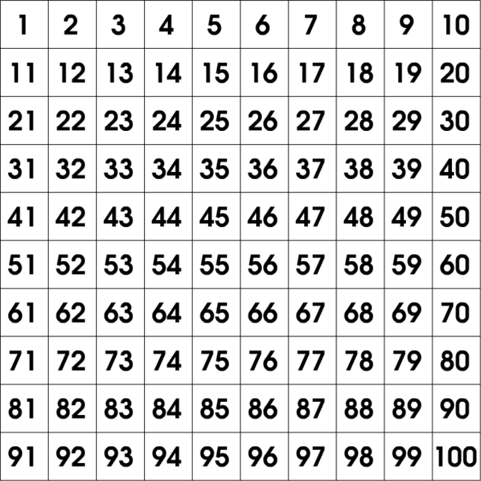

<div class="text-center p-4">
  
</div>

### Project Overview

This project involves a simple C program that calculates the average of a randomly generated list of integers. The numbers are stored in a linked list, and two functions are used to sum the numbers and count the total number of nodes. The program demonstrates the fundamental concepts of linked lists, such as node creation, insertion, and traversal, while also performing basic statistical calculations.

### Code Explanation

Here is the implementation in C:

```c
#include <stdio.h>
#include <stdlib.h>
#include <time.h>

// Node structure for linked list
struct Node {
    int data;
    struct Node* next;
};

// Function to insert a new node at the end of the list
void insert(struct Node** head, int data) {
    struct Node* newNode = (struct Node*)malloc(sizeof(struct Node));
    newNode->data = data;
    newNode->next = NULL;

    if (*head == NULL) {
        *head = newNode;
    } else {
        struct Node* temp = *head;
        while (temp->next != NULL) {
            temp = temp->next;
        }
        temp->next = newNode;
    }
}

// Function to calculate the sum of the integers in the list
int sum(struct Node* head) {
    int total = 0;
    struct Node* temp = head;
    while (temp != NULL) {
        total += temp->data;
        temp = temp->next;
    }
    return total;
}

// Function to count the number of nodes in the list
int count(struct Node* head) {
    int count = 0;
    struct Node* temp = head;
    while (temp != NULL) {
        count++;
        temp = temp->next;
    }
    return count;
}

// Function to print the list
void printList(struct Node* head) {
    struct Node* temp = head;
    while (temp != NULL) {
        printf("%d, ", temp->data);
        temp = temp->next;
    }
    printf("\n");
}

int main() {
    struct Node* head = NULL;
    int numElements;
    int i;

    srand(time(0));  // Seed the random number generator
    numElements = (rand() % 51) + 25;  // Generate between 25 and 75 elements

    for (i = 0; i < numElements; i++) {
        int randomNum = rand() % 101;  // Generate random numbers between 0 and 100
        insert(&head, randomNum);
    }

    printf("The list is: ");
    printList(head);

    int totalSum = sum(head);  // Calculate the sum of the list
    int totalCount = count(head);  // Count the nodes in the list
    float average = (float)totalSum / totalCount;  // Calculate the average

    printf("sum = %d\n", totalSum);
    printf("count = %d\n", totalCount);
    printf("average = %.2f\n", average);

    return 0;
}
