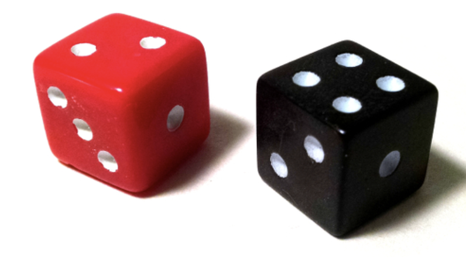

<div class="text-center p-4">
  
</div>

The **Rolling a Seven** project is a simple simulation in Java that counts the number of trials it takes to roll a sum of seven with two dice. Each trial involves rolling two six-sided dice repeatedly until the sum of seven is rolled. The simulation is repeated for a specified number of trials, and the results are displayed after each trial.

### Code Overview

The core functionality of this project is implemented in the `RollingASeven` class. The program takes user input for the number of trials, simulates the rolling of two dice, and counts how many rolls it takes to achieve a sum of seven.

```java
public class RollingASeven {
  public static void main(String[] args) {
    Scanner scnr = new Scanner(System.in);
    System.out.println("Number of Trials: ");
    Random r = new Random();
    int trials = scnr.nextInt();

    int sum = 0;

    for (int i = 1; i <= trials; i++) {
      System.out.print("Trial #" + i + ": ");
      int count = 0;
      int diceSum = 0;
      while (diceSum != 7) {
        int die1 = r.nextInt(6) + 1;
        int die2 = r.nextInt(6) + 1;
        diceSum = die1 + die2;
        count++;

        System.out.println("Die 1 rolled a " + die1);
        System.out.println("Die 2 rolled a " + die2);
      }
      sum += count;
    }
  }
}
